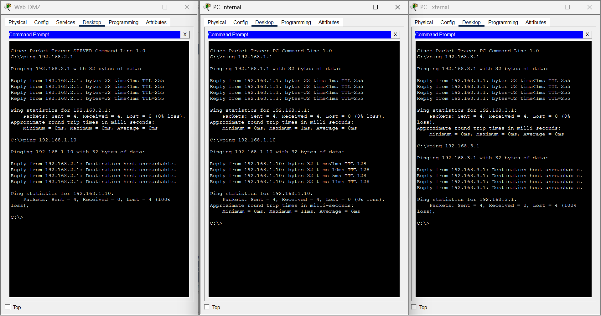

# Informe de laboratorio – DMZ con Cisco Packet Tracer

---

### 1. Objetivo del laboratorio

El objetivo era armar una red con tres zonas separadas: una red interna (LAN), una DMZ donde vive el servidor web, y una red externa que simula internet. La idea es que el servidor web pueda ser accedido desde afuera, pero sin que eso ponga en riesgo la red interna. Para eso se usó NAT y ACLs en el router.

---

### 2. Topología

La red tiene un router central (Router_FW) con tres interfaces, cada una conectada a una zona distinta mediante switches. A cada zona se le conecta un dispositivo final.

- **LAN interna** – tiene al PC_Internal, que representa un usuario de la empresa
- **DMZ** – tiene al servidor web (Web_DMZ), que es el que se expone a internet
- **Red externa** – tiene al PC_External, que simula ser alguien de internet

> *(agregar captura de la topología en Packet Tracer)*

---

### 3. Direccionamiento IP

| Dispositivo | IP | Máscara | Gateway |
|---|---|---|---|
| PC_Internal | 192.168.1.10 | 255.255.255.0 | 192.168.1.1 |
| Server Web_DMZ | 192.168.2.10 | 255.255.255.0 | 192.168.2.1 |
| PC_External | 192.168.3.10 | 255.255.255.0 | 192.168.3.1 |
| Router Gi0/0 (LAN) | 192.168.1.1 | 255.255.255.0 | — |
| Router Gi0/1 (DMZ) | 192.168.2.1 | 255.255.255.0 | — |
| Router Gi0/2 (Externa) | 192.168.3.1 | 255.255.255.0 | — |

---

### 4. Configuración del router

Primero se configuraron las tres interfaces del router con sus IPs y se activaron con `no shutdown`. Después se configuró el NAT y las ACLs.

#### Interfaces + NAT + ACLs (running-config)

Esta es la configuración final del router tal como quedó:

Lo más importante del running-config es:

- Las tres interfaces tienen su IP asignada
- Gi0/1 tiene `ip nat inside` y Gi0/2 tiene `ip nat outside`
- El NAT mapea `192.168.2.10` (IP privada del servidor) a `192.168.3.1` (IP pública)
- Se crearon dos ACLs: `ACL_WAN_IN` y `ACL_DMZ_IN`

#### ACLs y traducciones NAT activas

**ACL_WAN_IN** (aplicada en Gi0/2 entrada):
- Solo permite TCP al puerto 80 hacia `192.168.3.1`
- Todo lo demás queda bloqueado por el deny implícito (incluido el ping)

**ACL_DMZ_IN** (aplicada en Gi0/1 entrada):
- Permite tráfico TCP de retorno (`established`) del servidor hacia la LAN, para que las respuestas lleguen bien
- Bloquea cualquier conexión nueva que el servidor intente iniciar hacia la LAN
- Permite el resto del tráfico

En el `show ip nat translations` se puede ver que el NAT está funcionando, traduciendo las conexiones de `192.168.3.10:puerto` al servidor real `192.168.2.10:80`.

---

### 5. Pruebas realizadas

#### Pings de conectividad y bloqueos

- **Web_DMZ → gateway (192.168.2.1):** funciona ✅
- **Web_DMZ → PC_Internal (192.168.1.10):** bloqueado ✅ — esto es lo que se buscaba, el servidor no puede llegar a la red interna
- **PC_Internal → gateway (192.168.1.1):** funciona ✅
- **PC_Internal → 192.168.1.10 (sí mismo):** funciona ✅
- **PC_External → gateway (192.168.3.1):** funciona la primera vez (antes del ACL) ✅
- **PC_External → 192.168.3.1 (con ACL activa):** bloqueado ✅ — el ping desde internet no funciona, solo HTTP

#### Acceso web

- **PC_Internal** accede a `http://192.168.2.10` y carga la página ✅
- **PC_External** accede a `http://192.168.3.1` (la IP pública) y también carga la página gracias al NAT ✅

#### Resultado final

La actividad quedó completada al 100%.

---

### 6. Conclusiones

Lo que más me costó entender fue el tema del NAT y cómo afecta a las ACLs. Al principio puse la ACL con la IP privada del servidor (`192.168.2.10`) en lugar de la IP pública (`192.168.3.1`), y no funcionaba porque el router chequea la ACL antes de hacer la traducción NAT, entonces el paquete llega con la IP pública todavía.

También tuve problemas con las ACLs que bloqueaban el tráfico de retorno del servidor hacia la LAN. La solución fue agregar una regla `established` antes del deny, para que las respuestas a conexiones iniciadas desde la LAN puedan pasar.

En general el laboratorio ayuda bastante a entender por qué existe la DMZ y cómo funciona en la práctica. No es solo teoría, se puede ver claramente cómo el servidor queda aislado de la red interna aunque esté en la misma red física del router.
